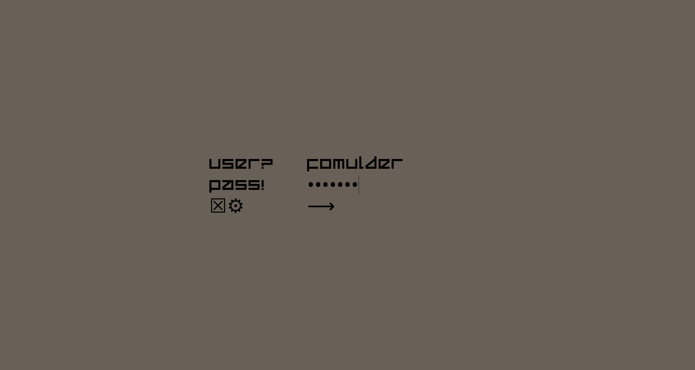
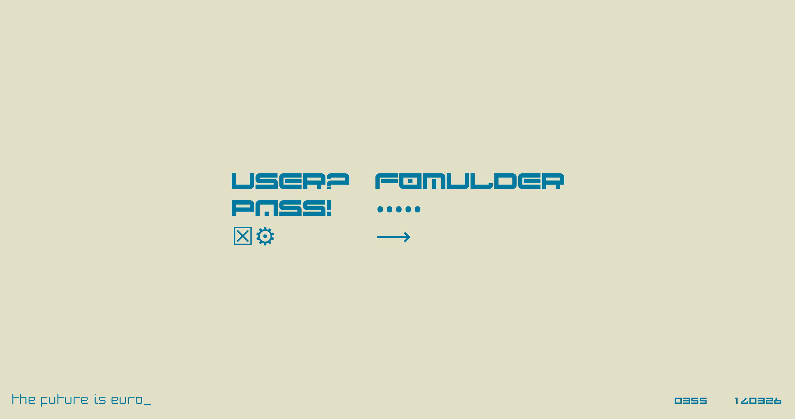
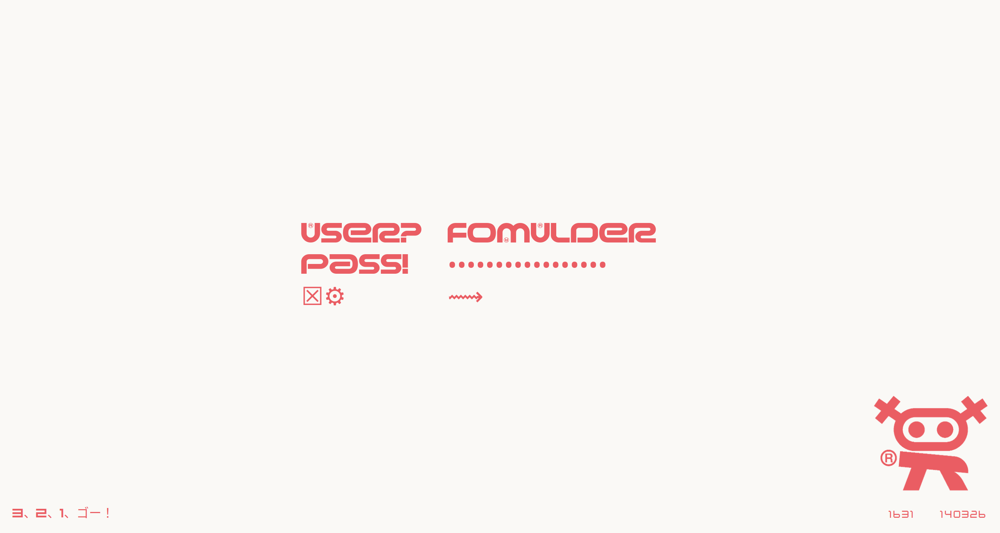
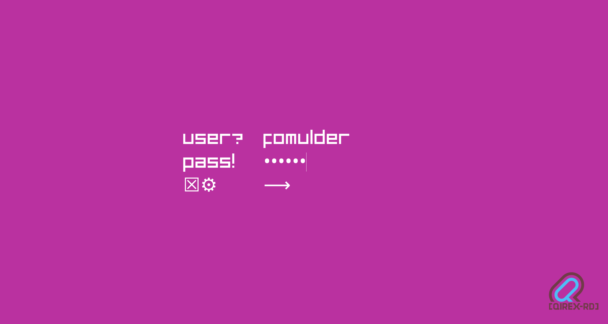
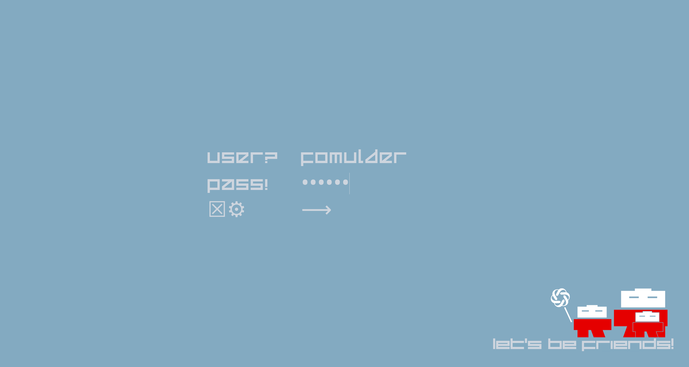
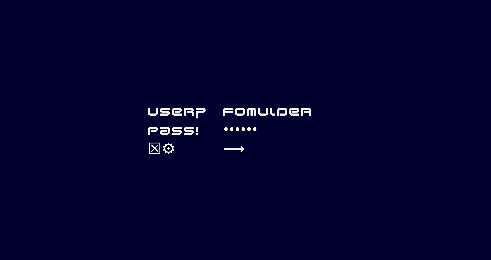
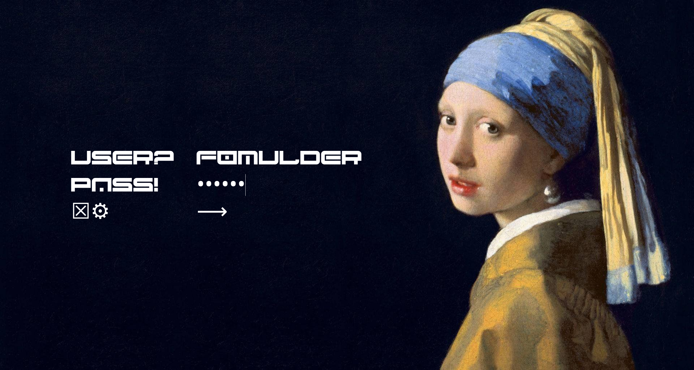

## F7200

A theme for web-greeter/nody-greeter that evokes the work of The Designers Republic and their series of PlayStation games, WipEout.

The theme is available in the release tab to the right.

Alternatively compile from src with npm/node.

## configuration

Edit `OPTIONS.json` and `colorSchemes.json` in the theme root before use to change fonts, colors.

Examples of configurations you can achieve with `OPTIONS.json` (find these in `./preDesignedOptionsConfigs`)

References for the fonts and color schemes in `./public` (root of release)

`feisar.json`

`curly.json`

`qirex.json`

`agsystems.json`

`XL97.json`

`vermeer.json`

## features

| user list | session select | power options | battery display

optionally,

| flavor text in the bottom left | a date/clock in the bottom right |

| a logo in the bottom right | backgrounds |

## references

[WipEout (1995)](<https://en.wikipedia.org/wiki/Wipeout_(video_game)>). Psygnosis. PlayStation.

[WipEout XL / WipEout 2097 (1996)](https://en.wikipedia.org/wiki/Wipeout_2097). Psygnosis. PlayStation, PC.

[Wip3out (1999)](https://en.wikipedia.org/wiki/Wip3out). Sony Studio Liverpool. PlayStation.

[The Designers Republic](https://www.thedesignersrepublic.com/)
